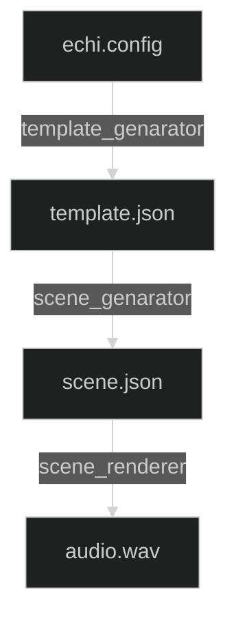

# ECHI Scene Generation

## 1. Overview

Scene generation is a multi-staged process



## 2. Scene Rendering

Turns a scene file into a multichannel audio file.

### 2.1 Scene File Format

The scene file is a list of dictionaries, each dictionary representing a single audio segment.

### 2.2 Scene Renderer

The scene render will generate multichannel audio from the scene file. This is a straightforward process of pre-allocation a n-channels by n-samples array and then filling in the samples from the audio segments.

## 3. Scene Generation

Scene generation will make a low level scene file from the high level template file.

### 3.1 Template File Format

Scenes are described in a nested dictionary format. With objects to represent sequences, splitters, conversations, noises and pauses.

Example template file:

```json
{
    "type": "sequence",
    "talkers": [1,2,3,4,5,6,7,8,9,10,11,12],
    "elements": [
       {
        "type": "splitter",
        "elements": [
            {"type": "sequence",
             "talkers": [1,2,3,4],
             "elements": [
                    {"type": "pause",
                     "duration": 20
                    },
                    {"type": "conversation",
                     "talkers": [1,2,3],
                     "duration": 120
                    },
                    {"type": "conversation",
                     "talkers": [1,3,4],
                     "duration": 120
                    },
                    {"type": "conversation",
                     "talkers": [3,4],
                     "duration": 120
                    }
                ]
            },
            {"type": "sequence",
             "talkers": [5,6,7,8],
             "elements":  [
                    {"type": "conversation",
                     "talkers": [5,6,7,8],
                     "duration": 120
                    },
                    {"type": "splitter",
                    "elements": [
                            {"type": "conversation",
                            "talkers": [5,6],
                            "duration": 120
                            },
                            {"type": "conversation",
                            "talkers": [7,8],
                            "duration": 120
                            }
                        ]
                    },
                    {"type": "conversation",
                     "talkers": [5,6,7,8],
                     "duration": 120
                    }
                ]
            },
            {"type": "conversation",
             "talkers": [9,10,11,12],
             "duration": 360
            }
        ]
       }
    ]
}
```

### 3.2 Scene Generator

This is a fairly complex process that involves instantiating a template to form a low level `scene.json` file. This is done by recursively walking the template and instantiating each object into a sequence of audio segments. The conversation objects are constructed using rules that govern turn taking and overlap. In sequence, objects are rendered sequentially in time. For splitter objects, each object in the splitter is rendered in parallel, and the object is not considered finished until all objects in the splitter are finished.
